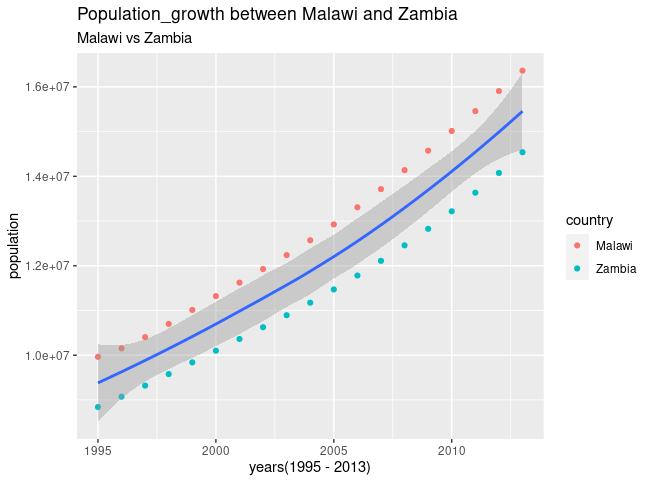

## Population Growth Between Zambia and Malawi (1995 - 2013)

- Malawi's population has grown significantly faster than Zambia's between 1995 and 2013. According to the R dataSET, Malawi had a population of over 9964065 in 1995 compared to Zambia's 8841338, and Malawi led with 16362567 compared to Zambia's 14538640 in 2013.

.png)